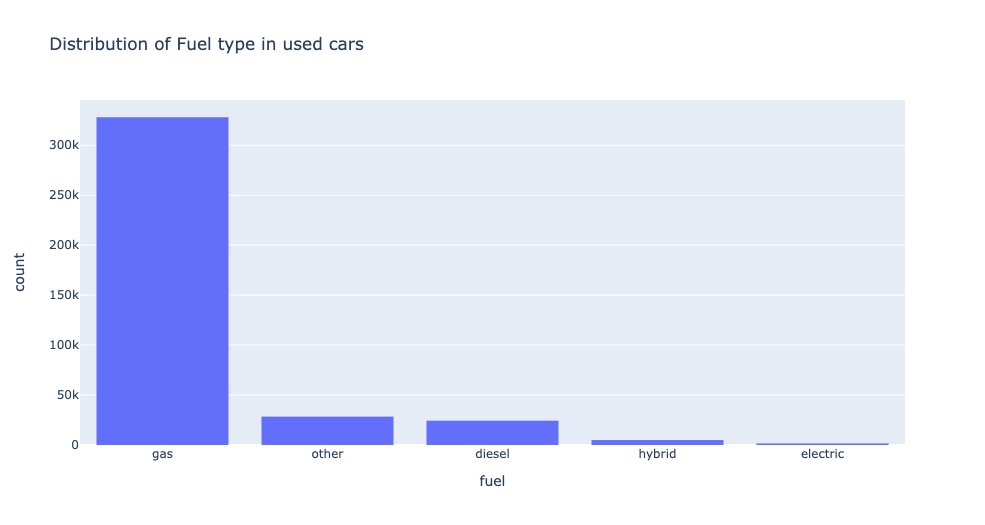
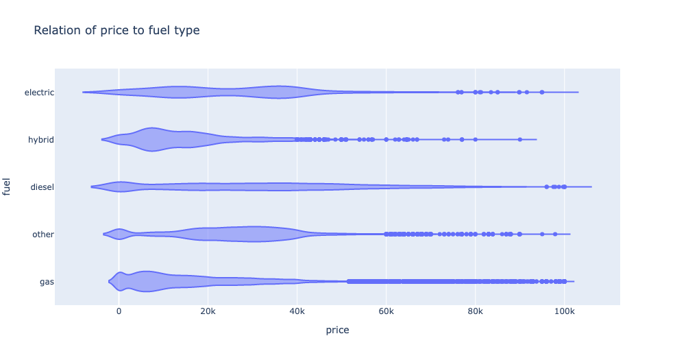

# What drives the price of a car?


**OVERVIEW**

In this application, you will explore a dataset from kaggle. The original dataset contained information on 3 million used cars. The provided dataset contains information on 426K cars to ensure speed of processing.  Your goal is to understand what factors make a car more or less expensive.  As a result of your analysis, you should provide clear recommendations to your client -- a used car dealership -- as to what consumers value in a used car.

### CRISP-DM Framework

<center>
    
</center>


To frame the task, throughout our practical applications we will refer back to a standard process in industry for data projects called CRISP-DM.  This process provides a framework for working through a data problem.  Your first step in this application will be to read through a brief overview of CRISP-DM [here](https://mo-pcco.s3.us-east-1.amazonaws.com/BH-PCMLAI/module_11/readings_starter.zip).  After reading the overview, answer the questions below.


### Business Understanding

From a business perspective, we are tasked with identifying key drivers for used car prices.  In the CRISP-DM overview, we are asked to convert this business framing to a data problem definition.  Using a few sentences, reframe the task as a data task with the appropriate technical vocabulary. 

__From the definition of [CRISP-DM](https://mo-pcco.s3.us-east-1.amazonaws.com/BH-PCMLAI/module_11/readings_starter.zip)__ we are tasked with identifying key drivers of used car prices. Customer for our insights is a __used car dealership__. 

When a consumer is looking for a car, there are many factors that could play into their decision: 
- Type/model and use case (recreational vs. commute vs. mobile office vs. taking kids to school). For e.g. if you are a gardener and need to haul your equipment you are probably looking for a truck and not a 4 door sedan
- Fuel efficiency: how far are they driving? Are gas prices a concern
- Stick shift vs. auto (maybe the consumer does not know how to drive a stick shift)
- etc.

While these determine what type of car a consumer is looking for, if there are in the used market, they are also hunting for bargain prices. So what affect prices of a used car?
- Condition of the car (implying maintenance costs further down the road)
- Age of the car (Regardless of maintanence diligence, after a certain age, a car is expensive to maintain unless it's a collectors item. Air quality regulations might also affect such decisions)
- History (have there been prior accidents?)

Given prior sales data, we have to evaluate the data and see what's clean and usable. From this we identify relationships to final prices a consumer was willing to pay. 

### Data Understanding

After considering the business understanding, we want to get familiar with our data.  Write down some steps that you would take to get to know the dataset and identify any quality issues within.  Take time to get to know the dataset and explore what information it contains and how this could be used to inform your business understanding.

#### EDA
Let's do some initial data exploration to see what the data quality looks like and any inherent relationships that the data has. 

We will do the following:
* Look at some example rows
* Eliminate any features that have too many NANs and hence will pollute the learning
* Fill in any features with minimal NANs with interpolated data
* Explore how particular features are spread out


```
RangeIndex: 426880 entries, 0 to 426879
Data columns (total 18 columns):
 #   Column        Non-Null Count   Dtype  
---  ------        --------------   -----  
 0   id            426880 non-null  int64  
 1   region        426880 non-null  object 
 2   price         426880 non-null  int64  
 3   year          425675 non-null  float64
 4   manufacturer  409234 non-null  object 
 5   model         421603 non-null  object 
 6   condition     252776 non-null  object 
 7   cylinders     249202 non-null  object 
 8   fuel          423867 non-null  object 
 9   odometer      422480 non-null  float64
 10  title_status  418638 non-null  object 
 11  transmission  424324 non-null  object 
 12  VIN           265838 non-null  object 
 13  drive         296313 non-null  object 
 14  size          120519 non-null  object 
 15  type          334022 non-null  object 
 16  paint_color   296677 non-null  object 
 17  state         426880 non-null  object 
dtypes: float64(2), int64(2), object(14)
memory usage: 58.6+ MB
```

```
Percentage of missing values in various features:
size            71.767476
cylinders       41.622470
condition       40.785232
VIN             37.725356
drive           30.586347
paint_color     30.501078
type            21.752717
manufacturer     4.133714
title_status     1.930753
model            1.236179
odometer         1.030735
fuel             0.705819
transmission     0.598763
year             0.282281
id               0.000000
region           0.000000
price            0.000000
state            0.000000
dtype: float64
```

### Data Preparation

After our initial exploration and fine tuning of the business understanding, it is time to construct our final dataset prior to modeling.  Here, we want to make sure to handle any integrity issues and cleaning, the engineering of new features, any transformations that we believe should happen (scaling, logarithms, normalization, etc.), and general preparation for modeling with `sklearn`. 

__First thing we notice is that some features/columns__ have a lot of null values. These are:
- size
- cylinders
- condition
- VIN
- drive
- paint color
- type

Let's drop these, except for `condition` since that seems like an important consideration for purchasing a used vehicle. 

__Let's look at condition and see what we want to do with it__

```
good         121456
excellent    101467
like new      21178
fair           6769
new            1305
salvage         601
Name: condition, dtype: int64
```

__Let's fill the NANs for condition with good, which is the median value__

__For the rest since the %age of NANs is low enough let's just drop the rows. We will still have enough rows for a good training set. We create a new DataFrame.__

```
<class 'pandas.core.frame.DataFrame'>
Int64Index: 389604 entries, 27 to 426879
Data columns (total 12 columns):
 #   Column        Non-Null Count   Dtype  
---  ------        --------------   -----  
 0   id            389604 non-null  int64  
 1   region        389604 non-null  object 
 2   price         389604 non-null  int64  
 3   year          389604 non-null  float64
 4   manufacturer  389604 non-null  object 
 5   model         389604 non-null  object 
 6   condition     389604 non-null  object 
 7   fuel          389604 non-null  object 
 8   odometer      389604 non-null  float64
 9   title_status  389604 non-null  object 
 10  transmission  389604 non-null  object 
 11  state         389604 non-null  object 
dtypes: float64(2), int64(2), object(8)
memory usage: 38.6+ MB
```

Now that we have cleaned our data let's look at how the features are distributed in the data

- Most of the models stocked and sold by used car dealerships is Ford, followed by Chevrolet. Trucks being very popular in the US...


- Most of the cars sold used have a clean title. Although there are others sold with less than ideal title status


- If the title status is not clean, the prices are distributed lower


- Trucks and SUVs are the most sold used cars. F150 as expected is the most popular. Outside of a few key values, it does not look like Model adds much inference capabilities. Let's drop it


- Odo reading have a lot of outliers and looks like bad labeling


- We will drop all rows which are above median + 1 std (~300k). It's also inconceivable that anyone wants to buy a used car that's not specialty and >300k miles


- Price also has a lot of outliers. Probably badly labeled data. Let's eliminate all rows which have a price listed as above 100k. At this price point we are talking about luxury specialty market which is not the intended business audience here


- Now that we have cleaned up outliers in odo readings and price. We notice that lower odo readings command higher prices. 


- Gas cars are the most sold in used cars



- Diesel cars tend to hold their value well



- Used cars predominantly have Automatic transmission


- But those with mixed transmission (auto and manual?) command higher prices


- Most used cars are a decade or two old. But there is a long tail of vintages


- Used cars are sold in all regions. Metros have more


- State population is correlated with used car sale volumes


- Condition is key to a used car price. Those in good or better condition hold their value. But other states have their uses


__We will also drop `id` since it's a numeric feature but not really related to used cars.__

### Modeling

With your (almost?) final dataset in hand, it is now time to build some models.  Here, you should build a number of different regression models with the price as the target.  In building your models, you should explore different parameters and be sure to cross-validate your findings.

Given the features and the clean up we did. We should encode some of the features.

We will use ordinal encoder for:
- region
- manufacturer
- state

We will use 1-hot encoder for:
- condition
- fuel
- title_status
- transmission

We will then train the following Linear Regression Variants:
- OLS
- Ridge
- Stochastic Gradient Descent

We will do a grid search with 5 fold cross validation and use mean squared error as the scoring since we are predicting a continous value

We will use a standard 70/30 split for train and test and train:
- Linear Regression
- Ridge
- Stochastic Gradient descent

For each we will also use polynomial features and search over other relevant parameters for each model.

We will employ a column transformer for the column transforms. A pipeline to string everything together and a grid search to find the best model parameters

```
X = df_clean.drop(columns=['price'])
y = df_clean['price']

X_train, X_test, y_train, y_test = train_test_split(X, y)

col_transformer = make_column_transformer(
    (OrdinalEncoder(), ['region', 'manufacturer', 'state']),
    (OneHotEncoder(), ['condition', 'fuel', 'title_status', 'transmission']),
    remainder='passthrough'
)

lr_params = {'poly__degree': [1,2]}

lr_pipe = Pipeline([
    ('encode', col_transformer),
    ('scale', StandardScaler()),
    ('poly', PolynomialFeatures()),
    ('lr', LinearRegression())
])

lr_grid = GridSearchCV(lr_pipe, param_grid=lr_params, cv=5, verbose=3, scoring='neg_mean_squared_error')

ridge_params = {'poly__degree': [1,2],
                'ridge__alpha': list(np.logspace(-1, 1, 3))
               }

ridge_pipe = Pipeline([
    ('encode', col_transformer),
    ('scale', StandardScaler()),
    ('poly', PolynomialFeatures()),
    ('ridge', Ridge())
])

ridge_grid = GridSearchCV(ridge_pipe, param_grid=ridge_params, cv=5, verbose=3, scoring='neg_mean_squared_error')

sgd_pipe = Pipeline([
    ('encode', col_transformer),
    ('scale', StandardScaler()),
    ('poly', PolynomialFeatures()),
    ('sgd', SGDRegressor())
])

sgd_params= {'poly__degree': [1,2],
             'sgd__penalty': ['l2', 'l1'],
             'sgd__alpha': list(np.logspace(-1, 1, 3))
            }

sgd_grid = GridSearchCV(sgd_pipe, param_grid=sgd_params, cv=5, verbose=3, scoring='neg_mean_squared_error')

lr_grid.fit(X_train, y_train)

ridge_grid.fit(X_train, y_train)

sgd_grid.fit(X_train, y_train)
```

### Evaluation

With some modeling accomplished, we aim to reflect on what we identify as a high quality model and what we are able to learn from this.  We should review our business objective and explore how well we can provide meaningful insight on drivers of used car prices.  Your goal now is to distill your findings and determine whether the earlier phases need revisitation and adjustment or if you have information of value to bring back to your client.

Now that we have done a grid search and fit various regression models. Let's evaluate their relative performance. 

```
Mean Absolute Error:
--------------------
OLS: 8515.31
Ridge: 7823.55
SGD: 8532.89
```

```
Mean Squared Error:
-------------------
OLS: 140382338.08
Ridge: 126834604.57
SGD: 140629286.44
```

__Based on the above Ridge performs the best both in terms of MAE (linear distance) and MSE (Area distance)__

Let's explore the Ridge model a bit more and the relative importance of features

```
{'poly__degree': 2, 'ridge__alpha': 10.0}
```


### Deployment

Now that we've settled on our models and findings, it is time to deliver the information to the client.  You should organize your work as a basic report that details your primary findings.  Keep in mind that your audience is a group of used car dealers interested in fine tuning their inventory.

#### Guidance to Used Car Dealers
After all of our explorations, here's what we can provide as guidance to the used car dealerships. What determines price of a used car?? Based on the factors that were clean and consistently present in the data, we can say:

- Year of manufacture is the most important factor
- Closely following this is the fuel type
    - Based on what we saw during EDA we can also say the diesel vehicles hold their value much better than other fuel types
    - Gas cars have a wide distribution and represent the most used vehicles
    - Electric cars are on the expensive end
- Mileage/Odometer of the car is the next most important factor. More odo means lower price
- Beyond these three other features need to align with user preferences
    - Tranmission is important and mixed transmission (like tiptronic) fetch higher prices
    - Condition and title status are important. These are skewed factors. When title_status is clean and condition is good or better, the rest of the factors play a major role. If not, this becomes the dominant factor since the demand pool shrinks

In addition, it's important to also __communicate to the Used car dealership that we couldn't consider some factors__ because they were not consistently collected in the data, but they could be important:
- `size`
- `cylinders` 
- `VIN`
- `drive`
- `paint_color`
- `type`

Of these `size` and `cylinders` could be particularly important, since these may play to particular interests and usage purposes. Going forward it would be good for the used car dealership to diligently collect this data so we can further analyse them.

### Next Steps

As next steps we could eliminate all NANs from the dataset and do an exploration of all features to see if the ones we dropped play any part in determining the prices. The training data will be cut down by >50% and the models might not have the performance we desire. So following the CRISP-DM framework it would be great to go back to data collection for these features so we have a more robust data set. 